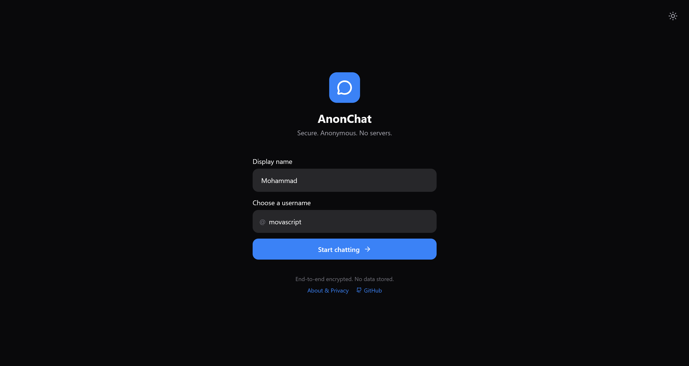
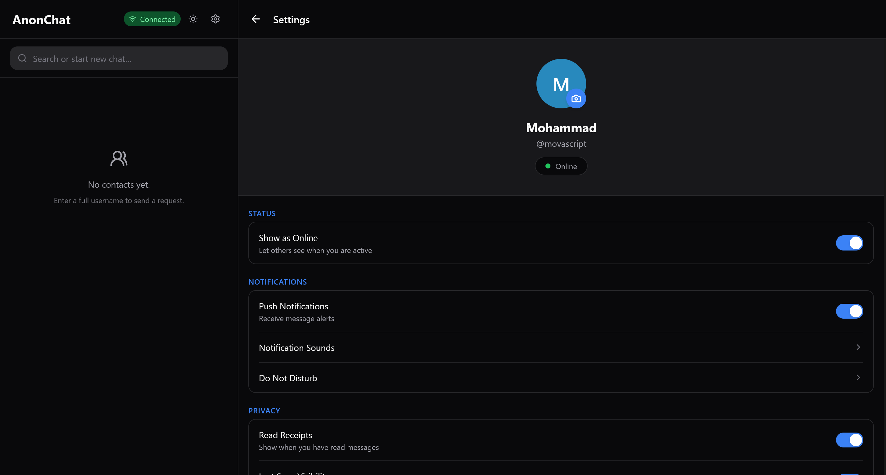
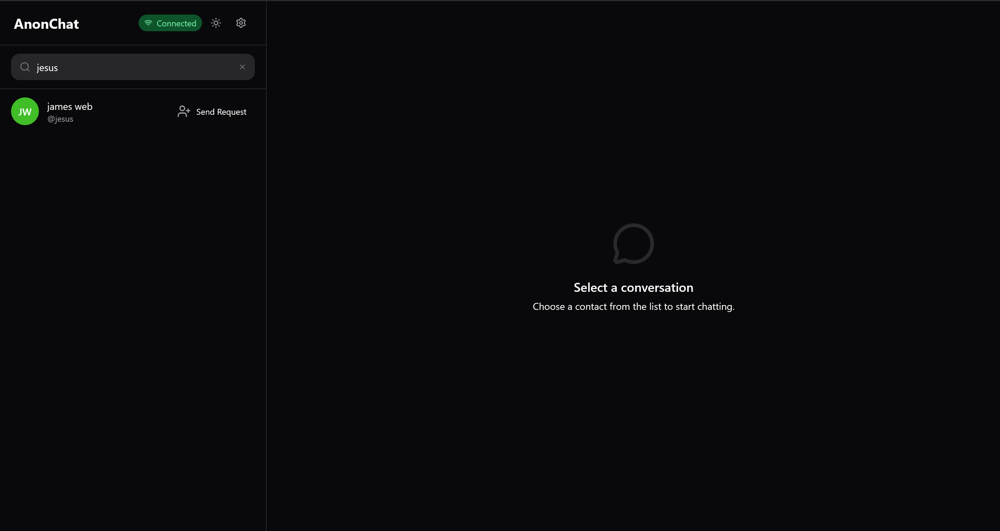
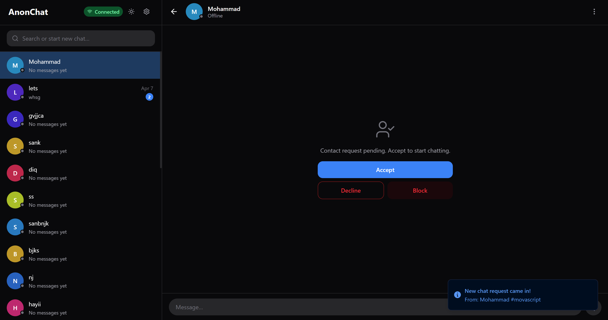
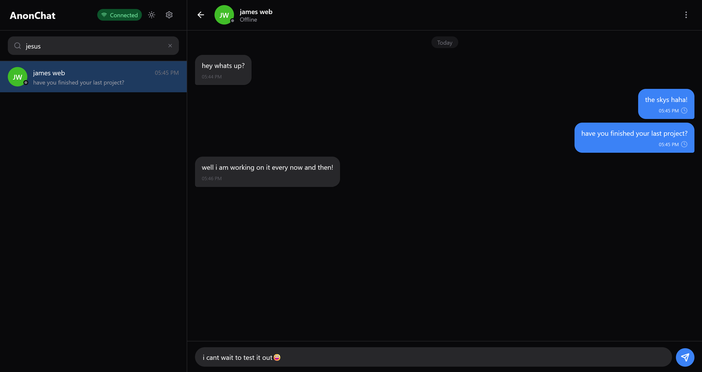
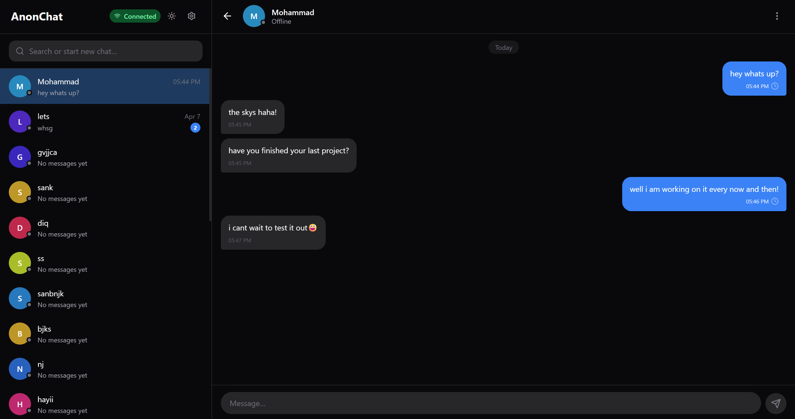
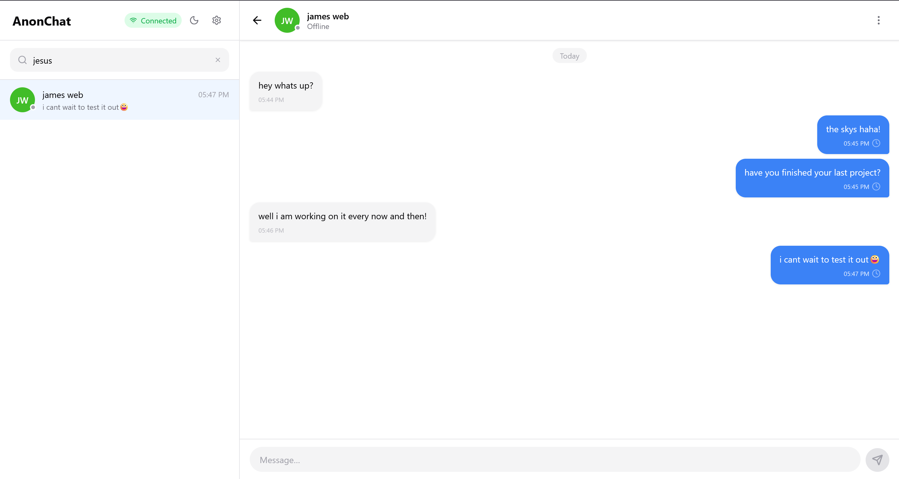
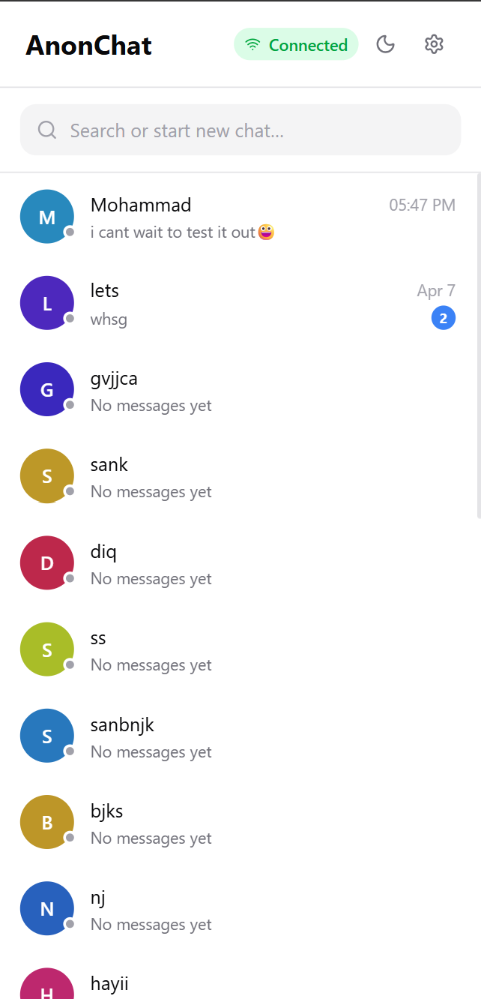
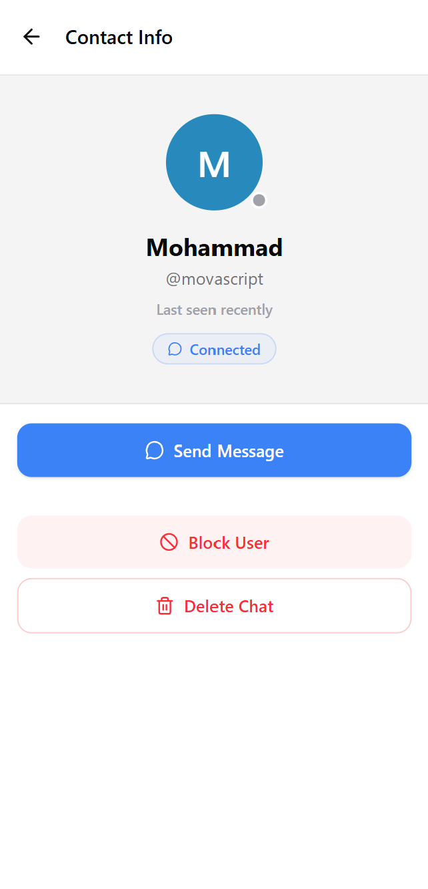

# AnonChat

Experimental real-time messaging platform with custom WebSocket architecture and client-side encrypted communication.

## Features

- Real-time messaging using native WebSocket (no Socket.io)
- Custom client/server WebSocket architecture
- Client-side message persistence with IndexedDB
- Experimental end-to-end encryption design
- Database-free relay server (messages not stored on backend)
- Offline-resilient local synchronization
- Monorepo structure for client and server

## Screenshots

## Overview

AnonChat is a real-time messaging system focused on privacy and low-level control over communication.

The project explores building a chat system without relying on frameworks like Socket.io and without storing user data on the server. All message persistence is handled on the client side.

## Architecture

### WebSocket Layer

Built directly on native WebSockets with custom event handling, connection management, and message routing.

### Client-Side Storage

IndexedDB is used for storing messages locally and maintaining offline-resilient chat history.

### Relay Server

The backend acts only as a transport layer, forwarding encrypted messages without persistence.

## Tech Stack

- React
- TypeScript
- Express
- WebSocket
- IndexedDB
- Tailwind CSS
- TanStack Router
- Monorepo setup
